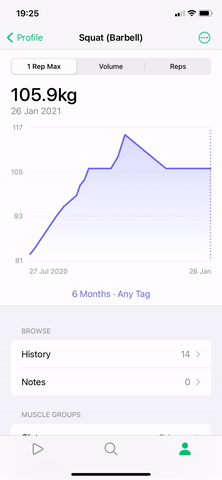

# SwiftUI Delayed Gesture

SwiftUI view modifiers to use gestures inside `ScrollView` and `List`.



## .delayedGesture()
Sequences a gesture with a long press and attaches the result to the view, which results in the gesture only receiving events after the long press succeeds.

### Usage
Use this view modifier *instead of* `.gesture()` to delay a gesture:

```swift
ScrollView {
    FooView()
        .delayedGesture(someGesture, delay: 0.2)
}
```

### Parameters
* `gesture`: A gesture to attach to the view.
* `mask`: A value that controls how adding this gesture to the view affects other gestures recognized by the view and its subviews.
* `delay`: A value that controls the duration of the long press that must elapse before the gesture can be recognized by the view.
* `action`: An action to perform if a tap gesture is recognized before the long press can be recognized by the view.

## .delayedInput()
Attaches a long press gesture to the view, which results in gestures with a lower precedence only receiving events after the long press succeeds.

### Usage
Use this view modifier *before* `.gesture()` to delay a gesture:

```swift
ScrollView {
    FooView()
        .delayedInput(delay: 0.2)
        .gesture(someGesture)
}
```

### Parameters
* `delay`: A value that controls the duration of the long press that must elapse before lower precedence gestures can be recognized by the view.
* `action`: An action to perform if a tap gesture is recognized before the long press can be recognized by the view.

## Requirements

- iOS 14.0+, watchOS 7.0+, or macOS 11.0+
- Xcode 12.0+

## Installation

Install using [Swift Package Manager](https://developer.apple.com/documentation/xcode/adding_package_dependencies_to_your_app).
